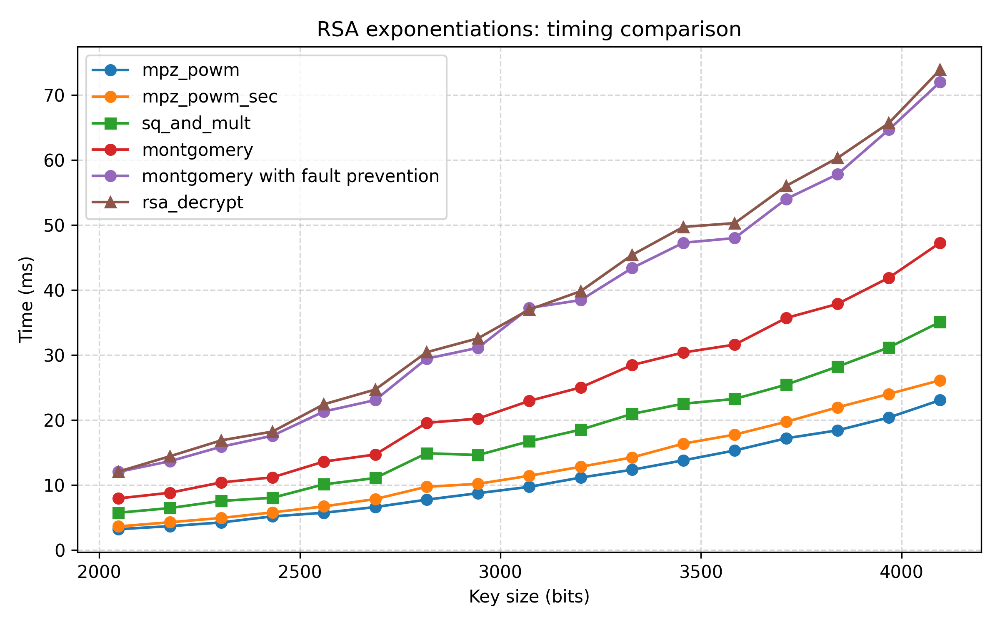

# RSA AVEC CONTRES MESURES VS SIDE CHANNEL

## Contexte et objectifs du projet

Une implémentation naïve du cryptosystème RSA avec l'algorithme classique d'exponentiation modulaire, dit "square and multiply", est vulnérable à des attaques par canaux auxiliaires (side channel) comme la Simple Power Analysis (SPA). En effet, square and multiply effectue une mise au carré du résultat pour chaque bit de l'exposant secret d, mais ne fait une multiplication que lorsque le bit de l'exposant est 1. Cela peut se lire directement sur les traces de courant, permettant de retrouver le secret d.

Il existe aussi d'autres attaques comme la Differential Power Analysis (DPA) ou la Correlation Power Analysis (CPA) qui vont utiliser un grand nombre de traces de courant et qui vont tenter de donner un score de corrélation entre une hypothèse sur le secret et les traces de courant. Cela permet de savoir quelle hypothèse de clé était la bonne, et donc de retrouver le secret.

Un dernier type d'attaque dont nous allons parler est l'analyse de faute ou Differential Fault Analysis (DFA). Elle consiste à injecter une faute lors de l'éxécution de l'algorithme à un instant précis, et d'en déduire de l'information par rapport à une éxécution non fautée, que ce soit en prédisant des résultats intermédiaires pendant l'exponentiation ou autre.

L'objectif de ce projet est donc d'implémenter RSA avec des protections contre les attaques citées ci-dessus.

## Choix d'implémentation

### Primitives RSA

- KeyGen
- Encryption
- Decryption
- Signature
- Verification

### Génération de premiers

On utilise l'entropie système (linux) pour générer des nombres aléatoires et on utilise mlock pour que les secrets $p$ et $q$ ne puissent pas fuiter
puis on écrase avec des 0 (secure_zero) avant de libérer l'espace mémoire.
Cela permet d'obtenir des nombres premiers cryptographiquement sûrs.
La génération de nombre aléatoires sécurisés va nous permettre de générer des clés privées et de faire du masquage de message/module/exposant.

### Exponentiation modulaire

Nous avons plusieurs fonctions d'exponentiation à notre disposition :
les square and multiply classiques, les square and multiply always, la Montgomery ladder et la Joye ladder.

Ici on fait le choix d'utiliser la Montgomery ladder pour avoir un algorithme régulier (protège contre la SPA), et qui permet de prévenir des injections de faute.

### Masquages de message, d'exposant et de module

Les masquages (blindings) se font toujours du côté du détenteur de la
clé privée, lors des opérations qui la manipulent, afin de la protéger.
Concrètement : on masque avant de déchiffrer/signer
puis on démasque juste après, avant d'envoyer le résultat.

#### Masquage de message

- on choisit $r$ random entre $0$ et $n$, inversible $\mod n$
- masquer : $m' \equiv (m r^e) \mod n$
- calcul privé : $s' = (m')^d \mod n = m^d r \mod n$
- démasquer : $s = s' r^{-1} \mod n = m^d \mod n$
  
Notons que l'on utilise un masquage multiplicatif du message
(et non additif : $m' = m + rn$ car cela disparait dès le premier mod $n$)

#### Masquage d'exposant

- on choisit $k$ random entre $0$ et $n$
- $d' = d + k \phi(n)$
- $s \equiv m^d \mod n = m^{d'} \mod n$ par Euler

#### Masquage de module

- on choisit $r$ random entre $0$ et $n$, concrètement on prend $r$ pas trop grand pour ne pas trop alourdir les calculs (128 bits max)
- $N' = rN$ puis on fait les calculs mod $N'$
- pour démasquer il suffit de réduire mod $N$ le résultat
  
Pourquoi cela fonctionne :
pour tout entier $x$ et tout $N' = rN$ ($r$ entier $\geq 1$),
$(x \mod N') \mod N = x \mod N$

Preuve :
$x ≡ x \mod N' (\mod N')$, donc $x − (x \mod N')$ est multiple de N' donc multiple de N, donc $x ≡ x \mod N' (\mod N)$. Ainsi les restes modulo N coïncident.

## Sécurité apportée par notre implémentation

L'algorithme de la Montgomery ladder est régulier et protège donc contre la SPA. De plus, la vérification à chaque tour de boucle bloque les injections de faute et les attaques du type de la DFA.

Ensuite, le masquage d'exposant protège contre les attaques qui utilisent plusieurs traces de courant : DPA, CPA, ... car pour chaque trace l'exposant est différent, ce qui empêche de trouver des corrélations entre les traces.

Le masquage de module complique la prédiction de valeurs intermédiaires liées à la valeur du module $N$.

Enfin le masquage de message protège contre certaines attaques en empêchant les corrélations entre le message et les fuites que ce soit de courant, temps, etc.
Il permet aussi de renforcer le masquage de module en compliquant les prédictions de valeurs intermédiaires.

## Compléxité et Surcoût de notre implémentation

### Coût de l'exponentiation modulaire

Pour un square and multiply classique, si l'exposant a $n$ bits, et le module $k$ bits, on a un coût de $O(n k^2)$. En effet la multiplication modulaire coûte $O(k^2)$, et on fait ~ 1.5 multiplication par bit d'exposant, ce qui donne $O(1.5n  k^2) = O(n k^2)$.

Avec la montgomery ladder, c'est similaire sauf que pour chaque bit d'exposant on fait une multiplication et une mise au carré, donc la constante multiplicative passe de 1.5 à 2 -> on a un coût de $O(2n k^2) = O(n k^2)$, soit un surcoût de ~$4/3 \times$ par rapport à un square and multiply classique.

Mais notre algorithme de Montgomery ladder fait aussi une vérification pour prévenir les injections de faute : cela coûte une multiplication modulaire supplémentaire à chaque itération de boucle et une condition dans laquelle on test l'égalité entre deux mpz_t... ce qui peut amener à rajouter ~$k^3$ opérations.

Concrètement ici pour un exposant publique e petit, l'exponentiation coûte $O(k^2)$ (rapide).
Par contre pour un exposant privé d d'environ k bits, on a un coût de $O(k^3)$ : ~ $1.5k^3$ pour le square and multiply classique et ~ $2k^3$ pour la Montgomery ladder.

En principe mpz_powm est optimisée et est plus rapide.

### Coût du masquage de message

Ce masquage demande de générer $r$, de l'inverser puis de faire une multiplication modulaire supplémentaire par $r$ puis une multiplication modulaire par $r^{-1}$ pour démasquer à la fin. Les multiplications modulaires coûtent $O(k^2)$ et l'inversion coûte $O(k^3)$ (dans le pire cas si on utilise l'algorithme d'euclide étendu), donc on a un surcoût de $O(k^3)$ (mpz_invert utilise des FFT pour ses algorithmes de multiplication donc va en pratique plus vite) pour le masquage de message.

### Coût du masquage d'exposant

On génère un nombre relativement petit, qui augmente peu la taille de l'exposant secret d, donc le surcoût est relativement faible. Plus précisément, les exponentiations modulaires passent de $O(k^3)$ à $O((k + \lambda)k^2)$ si $r$ est de longueur $\lambda$ bits.

### Coût du masquage de module

Lorsque l'on calcule $N' = rN$, et que l'on fait les exponentiations modulaires modulo $N'$ au lieu de $N$, leur coût passe de $O(k^3)$ à $O(k(k + \lambda)^2)$ si $r$ est de longueur $\lambda$ bits.

Au final, notre implémentation coûte en théorie plus cher qu'un RSA
naïf : on multiplie le temps par un petit facteur constant, surtout à cause de la Montgomery Ladder, de l'inversion de r lors du masquage de message et de l'augmentation de la taille du module du fait du masquage de module.

### Résultats expérimentaux et conclusion

Suite au test de notre code, on voit que mpz_powm est plus rapide d'environ 30% qu'un square and multiply classique, et que notre
algorithme de déchiffrement est environ 4 fois plus lent que mpz_powm et un peu plus de 2 fois plus lent que sq&mul. Ceci est cohérent avec
l'analyse théorique précédente.

Cependant on voit aussi que l'algorithme de Montgomery ladder avec détection de fautes seul, sans les masquages, est quasi aussi lent qu'avec les masquages.
L'inversion de r n'est donc pas si coûteuse, de même que les masquages, grâce aux choix des aléas de taille relativement petite. Ce qui coûte est la vérification sur l'injection de faute dans notre algorithme de Montgomery ladder.

Notons aussi que la fonction mpz_powm_sec de gmp, qui utilise un algorithme régulier d'exponentiation, est presque aussi rapide que mpz_powm, par contre on perd le contrôle sur l'injection de fautes.

## Limites de ce code et ouvertures possibles

Tout d'abord nous venons de voir que ce code est bien plus lent que la fonction sécurisée mpz_pown_sec de gmp. Ceci est en grande partie dû à la vérificaton d'injection de faute à chaque tourde boucle. Étant donné que les masquages protègent déjà beaucoup contre les injections de faute, il pourrait être judicieux de faire cette vérification que quelques fois, et pas à chaque tour, ce qui réduirait grandement le coût.

Ensuite, l'implémentation n'est pas en temps constant, du fait de l'utilisation de gmp qui n'est pas intrinsèquement sécurisée. Une attaque temporelle avancée peut donc en théorie retrouver les secrets.
Il faudrait réécrire une librairie Bignum en temps constant pour les opérations que l'on utilise : multiplication, modulo, addition.
Cependant cela ajouterait des problèmes : les masquages (en particulier de module) augmentent la taille du module, ce qui risque de faire dépasser les tailles fixes qu'imposent une librairie Bignum en temps constant.

Aussi, notre implémentation de la Montgomery ladder n'est pas complètement sécurisée. En effet, il y a des accès mémoire qui se font en dépendant du secret : on accède à R[0] quand le bit de l'exposant $d$ est à 1, et R[1] sinon. Un adversaire puissant peut en théorie s'en servir pour retrouver $d$. Le masquage d'exposant protège quand-même $d$, mais ici cela ne suffit pas puisqu'en connaissant $d'$ on peut aussi déchiffrer et signer.

Par ailleurs nous avons uniquement mis en oeuvre RSA en mode classique.
Le mode CRT augmente la surface d'attaque et les masquages sont plus difficiles à faire correctement. Cependant le mode CRT permet en théorie de diviser par 4 le temps de déchiffrement/signature car les tailles des modules sont dans ce cas divisées par 2, mais demande deux exponentiations coûtant: $O((k/2)^3) = O(\frac{1}{8} k^3)$.

Une dernière faiblesse notable de ce RSA est due au fait que l'on utilise pas de "padding" ni d'ajout de sel. Cela rend RSA déterministe et ouvre la porte à d'éventuelles attaques par message choisi.

Enfin, ce projet est avant tout un exercice pour implémenter des contre mesures contre des attaques classiques de side channel, et pas une implémentation de RSA optimisée pour la production. Il ne faut donc pas l'utiliser dans des cas réels. Préferer des librairies éprouvées et auditées pour des applications de production comme openssl.
